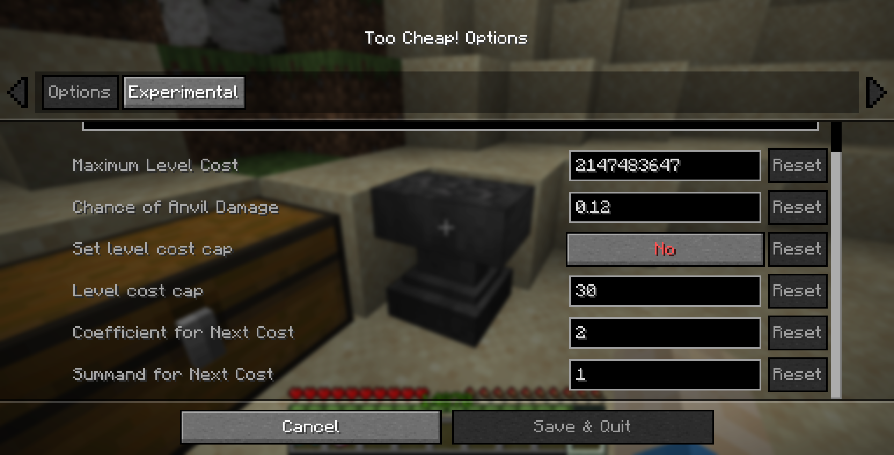
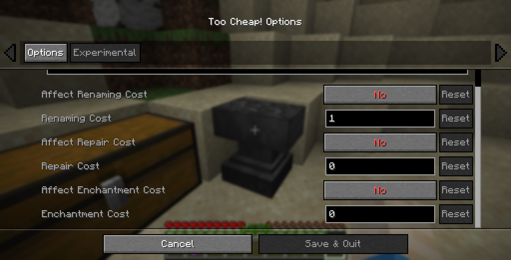

Anvils only allow items to be combined if the cost is less than `40` levels. Otherwise, the **Too Expensive!** message is displayed. This leads to a complicated order of combining books to get the best gear before you can't add any more enchantments.

This mod replaces the arbitrary value of `40` levels with `2147483647` (the maximum value of a Java Integer). By default, the costs of using anvils are not changed and the scaling remains the same.

# Settings and Configuration

The mod allows you to set the maximum level cost, the chance of anvil damage, an (optional) level cost cap, and the cost increase rate.

Additional experimental settings allow to change some internal values that I've tried to identify. No guarantee they actually do what it says.

These settings can either be changed in the config file or, if the optional dependency [Mod Menu](https://modrinth.com/mod/modmenu) is installed, in a GUI interface.

# Frequently Asked Questions

**Q: Can I use this mod in my modpack?**

A: Of course.

**Q: Is this mod available in version X.Y.Z?**

A: Probably. If you want the mod for a version that is not yet available, just open a [GitHub Issue](https://github.com/the-sh4d0w/too-cheap/issues) or ask on [Discord](https://discord.gg/4CaBuwEWKx).

**Q: My game crashed/I think I found a bug/...**

A: Open a [GitHub Issue](https://github.com/the-sh4d0w/too-cheap/issues) and give as much detail as possible. Alternatively, you can report on [Discord](https://discord.gg/4CaBuwEWKx).

**Q: I have some feedback or an idea for a new feature.**

A: Join the [Discord](https://discord.gg/4CaBuwEWKx). I would like to hear your opinion about my mod.